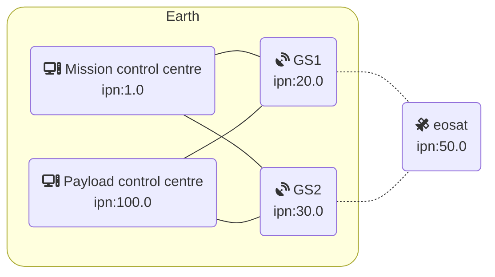

Scenario: Earth Observation
===========================

## Scenario Definition
The EO scenario is a simple network scenario with a single satellite, 2 ground stations, 1 mission control centre (MCS) and 1 payload centre.
In this scenario the satellite passes are frequent and data can be downlinked at high speed.

## Topology

## Datarates
|  from\to     | Mission Control Centre | Payload Control Centre  | Ground Station | Satellite |
| -            | -                      | -                       | -              | -         |
| __Mission Control Centre__ | /        | 0                       | 100            | 0         |
| __Payload Control Centre__ | 0        | /                       | 100            | 0         |
| __Ground Station__ | 100              | 100                     | /              | 64Kbps    |
| __Satellite__ | 0                     | 0                       | 8Mbps/10Gbps   | /         |  

- TC Uplink: 64 kBits
- HK TM Downlink: 8 Mbps
- Payload TM Downlink: 10 Gbits

## Datarates scaled for simulation
|  from\to     | Mission Control Centre | Payload Control Centre  | Ground Station | Satellite |
| -            | -                      | -                       | -              | -         |
| __Mission Control Centre__ | /        | 0                       | 10            | 0         |
| __Payload Control Centre__ | 0        | /                       | 10            | 0         |
| __Ground Station__ | 10              | 10                     | /              | 0.1    |
| __Satellite__ | 0                     | 0                       | 1 (HK), 1000 (Payload)  | /         |  

## Contacts

For this scenario, two contact plans are provided:
- [eo.testing.contacts.ccp](eo.testing.contacts.ccp): this simple plan is just alternating between both ground stations with 30s of no contact in between.
- [eo.realtime.contacts.ccp](eo.realtime.contacts.ccp): this plan has realistic contacts and runs in realtime, thus, long delays between contacts.

By default the `start_net.sh` script runs the testing contacts but you can provide another contact plan as first parameter.

## Actions

An [example action file](eo.actions) is provided. It just starts a few processes and cleans up stuff in the end. Here, one would usually start a BP agent and periodically send some messages.

## Docker: Running the Scenario

1. start the docker containers and setup the network: `./start_topo.sh`
2. if you want fluctuating connectivity and bandwidth limitations: `./start_net.sh`
3. start the automatic actions on the nodes: `./start_actions.sh`
4. *OPTIONALLY: start the network visualization: `./start_viz.sh`*
5. *OPTIONALLY: start the docker test bed manager: `nse2_mgr eo.compose.yml eo.testing.contacts.ccp`*

You can get an interactive shell on any of the nodes through docker: `docker exec -it <node> bash` or `nse2_sh <node>`
