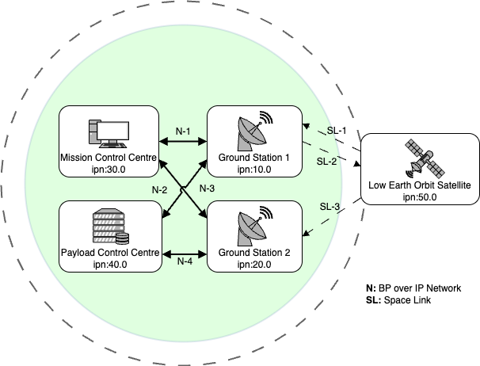

Scenario: Earth Observation
===========================

## Scenario Definition
The EO scenario is a simple network scenario with a single satellite, 2 ground stations, 1 mission control centre (MCS) and 1 payload centre.
In this scenario the satellite passes are frequent and data can be downlinked at high speed.

## Topology




## Datarates
|  from\to                   | Mission Control Centre | Payload Control Centre  | Ground Station 1 | Ground Station 2 | Satellite |
| -                          | -                      | -                       | -                |                  | -         |
| __Mission Control Centre__ | /                      | 0                       | 100 Mbps         | 100 Mbps         | 0         |
| __Payload Control Centre__ | 0                      | /                       | 100 Mbps         | 1000 Mbps        | 0         |
| __Ground Station 1__       | 100 Mbps               | 100 Mbps                | /                | 0                | 64 kbps   |
| __Ground Station 2__       | 100 Mbps               | 100 Mbps                | 0                | /                | 0         |
| __Satellite__              | 0                      | 0                       | 8Mbps            | 1000 Mbps        | /         |  

- TC Uplink: 64 kbps
- HK TM Downlink: 8 Mbps
- Payload TM Downlink: 1 Gbps


## Contact Plan and Compose File

The contact plan [contacts.ccp](contacts.ccp) is generated from
`actual_contacts.csv` via `csv_to_ccp.py`. The compose file
[compose.yml](compose.yml) is generated from the same CSV via
`csv_to_compose.py`.

The CSV-to-Compose conversion uses `nodes.json` for node metadata and strips
the `eo` prefix from node names. The generated contact plan also strips the
`eo` prefix. Both generated files contain the date and command used to create
them.

For short test runs, [contacts_testing.ccp](contacts_testing.ccp) is derived
from `contacts.ccp` with `random-contacts.py`:

```bash
random-contacts.py contacts.ccp contacts_testing.ccp \
  --length 120 --min-contact 30 --max-contact 30 --seed 0
```

This preserves fixed links and dynamic link properties while replacing the
original contact windows with one randomized 30-second window per unique
dynamic direction. The `start_net.sh` script uses `contacts.ccp` by default,
but accepts another contact plan as its first argument.

## Actions

An [example action file](eo.actions) is provided. It just starts a few processes and cleans up stuff in the end. Here, one would usually start a BP agent and periodically send some messages.

## Docker: Running the Scenario

1. start the docker containers and setup the network: `./start_topo.sh`
2. if you want fluctuating connectivity and bandwidth limitations: `./start_net.sh`
3. start the automatic actions on the nodes: `./start_actions.sh`
4. *OPTIONALLY: start the network visualization: `./start_viz.sh`*
5. *OPTIONALLY: start the docker test bed manager: `nse2_mgr compose.yml contacts.ccp`*

You can get an interactive shell on any of the nodes through docker: `docker exec -it <node> bash` or `nse2_sh <node>`
