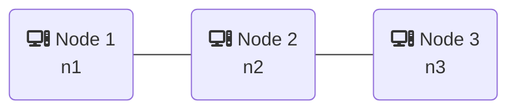

Scenario: Simple
===========================

## Scenario Definition
The `simple` scenario is a basic network scenario with three generic nodes (n1, n2, and n3) connected in a straight line. 
It is primarily used as an introductory scenario in the user manual to demonstrate the core features of NSE2, such as setting up a topology, running fluctuating contacts, and automating actions.

## Topology

## Datarates
|  from\to | Node 1 | Node 2 | Node 3 |
| -------- | ------ | ------ | ------ |
| __Node 1__ | /    | 100 Mbps | 0    |
| __Node 2__ | 100 Mbps | /  | 2 Mbps |
| __Node 3__ | 0    | 2 Mbps | /      |

## Contacts

The scenario uses a simple repeating contact plan ([contacts.ccp](contacts.ccp)):
- A fixed, continuous link between `n1` and `n2` with 100 Mbps bandwidth and 100ms delay.
- A fluctuating link between `n2` and `n3` with 2 Mbps bandwidth and 10ms delay, which is active for 20 seconds within a 40-second repeating time window.

## Actions

The [actions file](actions.txt) performs the following tasks:
- Logs the startup time on each node.
- Periodically sends pings from `n1` to `n2`, and from `n2` to `n3` to log link properties and verify connectivity.
- Contains a cleanup routine to kill long-running processes when exiting.

## Docker: Running the Scenario

You can start the different components of the simulation using the provided tools:

1. Start the docker containers and setup the network: `nse2_topo compose.yml`
2. Start the contact plan playback: `nse2_contacts -m contacts.ccp`
3. Start the automated actions on the nodes: `nse2_actions actions.txt`
4. *OPTIONALLY: start the network visualization frontend: `nse2_netviz viz.json`*
5. *OPTIONALLY: start the docker test bed manager: `nse2_mgr compose.yml contacts.ccp`*

*(Hint: Use a terminal multiplexer like `tmux` to run these concurrently, or simply use the provided `run.sh` script to automate the startup.)*

You can get an interactive shell on any of the nodes through docker: `docker exec -it <node> bash` or `nse2_sh <node>`
