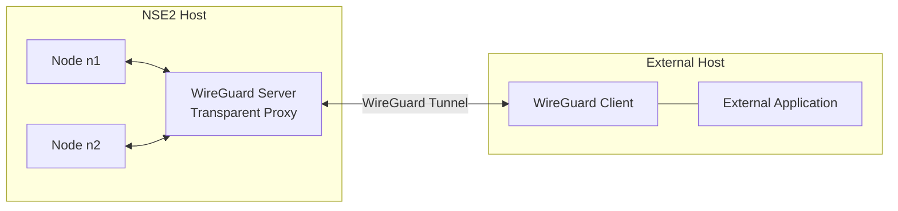

## WireGuard External Service Example

This scenario connects one external service to NSE2 through a WireGuard tunnel.
NSE2 runs the WireGuard server alongside the example nodes `n1` and `n2`.
The external host runs the WireGuard client and an application that shares the client's network namespace.

This example uses the [LinuxServer.io WireGuard container](https://github.com/linuxserver/docker-wireguard).
Refer to its documentation for additional configuration options and container requirements.




Traffic addressed to either of the `wg-server` Docker addresses is DNATed by `server/setup-iptables.sh` to the external peer's tunnel address.
The external application shares the WireGuard client's network namespace and therefore requires no additional routing configuration.

This example supports one external WireGuard peer.

### Configuration

Before starting the server, review the following values in `compose.yml`:

- `SERVERURL` must be an address through which the external host can reach the NSE2 host. Use `host.docker.internal` when testing both sides on the same machine.
- `SERVERPORT` must match the UDP port published by the `wg-server` service.
- `ALLOWEDIPS` must include every NSE2 network that the external service should be able to reach through the tunnel.


### Setup

Start the NSE2-side services:

```sh
docker compose up -d
```

The WireGuard server generates its keys and the external peer configuration
under `server/runtime`. The generated client configuration is:

```text
server/runtime/peer_external/peer_external.conf
```

Copy this file to `client/wg0.conf` on the external host:

```sh
scp server/runtime/peer_external/peer_external.conf \
    user@external-host:/path/to/examples/wireguard/client/wg0.conf
```

The configuration contains the external peer's private key and must not be
committed to Git. Restrict its permissions on the external host:

```sh
chmod 600 client/wg0.conf
```

Start the WireGuard client and external application:

```sh
docker compose -f compose-client.yml up -d
```


### Testing

Check that the tunnel has established a handshake:

```sh
docker compose exec wg-server wg show
docker compose -f compose-client.yml exec wg-client wg show
```

The example application listens on port 80. Test it from both NSE2 nodes:

```sh
docker compose exec n1 curl --fail http://172.30.0.2
docker compose exec n2 curl --fail http://172.31.0.2
```

Both requests should return:

```text
Hello from external WireGuard service!
```

Within the Compose networks, Docker DNS can resolve the WireGuard server by its service name.
The application can therefore also be reached through `wg-server`:

```sh
docker compose exec n1 curl --fail http://wg-server
docker compose exec n2 curl --fail http://wg-server
```

The generated client configuration routes the NSE2 Docker networks listed in `ALLOWEDIPS` through the WireGuard tunnel.
It also uses the DNS server configured by the WireGuard container, allowing the external side to resolve and connect to `n1` and `n2` by name.

```sh
docker compose -f compose-client.yml exec wg-client ping n1
docker compose -f compose-client.yml exec wg-client ping n2
```

